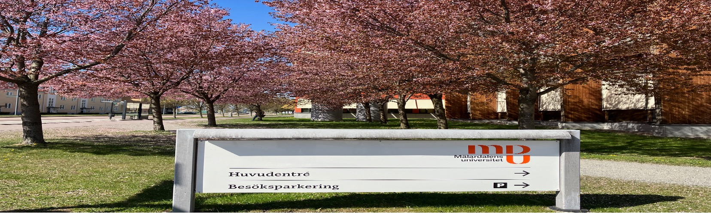
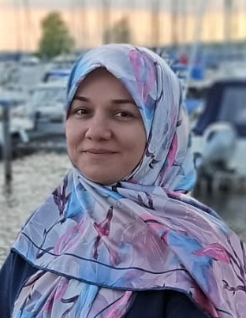

<!--

-->

<!--

-->

<!--  -->

## Zahra Moezkarimi
I am a postdoctoral researcher at Mälardalen University (MDU) in Västerås, Sweden. I work on modeling, formal verification, and synthesis of Cyber-Physical Systems, with an interest in data-driven approaches.

Currently, my research focuses on redundant distributed controllers and controller synthesis. My main tool for this work is Rebeca (Reactive Object Language), an actor-based language tailored for the modeling and formal verification of reactive, concurrent, and distributed systems. I use the timed extension of Rebeca, Timed-Rebeca, and Rebeca's user-friendly model checking tool, Afra.

<!--
I am currently working on modeling and formal verification of Cyber-Physical Systems (CPS), with a particular focus on redundant distributed controllers and controller synthesis. My main tool for this work is Rebeca (Reactive Object Language), an actor-based language tailored for the modeling and formal verification of reactive, concurrent, and distributed systems. I am utilizing the timed extension of Rebeca, Timed-Rebeca, and Rebeca's user-friendly model checking tool, Afra.
-->

   

## Research Interests

<h3>Cyber-Physical Systems (CPS)</h3>
<b>Definition</b>: Cyber-physical systems (CPS) provide an excellent basis for digitizing advanced industrial systems and applications. CPSs integrate physical, computational and communication subsystems, typically including sensors, controllers and actuators. These systems are used in a wide range of applications including, but not limited to, automotive, avionics, robotics and smart grids.  

<b>My research interest</b> Digital Twins, Consistency in Distributed Systems 
  
  
<h3>Privacy Policies</h3>
<b>Definition</b>: The concept of privacy was initially introduced as ‘the right to be left alone’ and is recognized as a fundamental human right by many international norms and regulations. Privacy is further elaborated by Alan Westin as ‘the claim of individuals, groups, or institutions to determine for themselves when, how and to what extent information about them is communicated’; this is currently known as the informational self-determination right and used as a means to limit the abuse of personal data. 

[See: A policy-aware epistemic framework for social networks](https://academic.oup.com/logcom/article/32/6/1234/6564903)

<b>My research interest</b>: Policy-aware systems <!-- , Automated reasoning, Secure-by-construction systems. -->
  
  
<h3>Epistemic Logic</h3> 
<b>Definition</b>: A logic for reasoning about agents' knowledge and beliefs.   

<b>My research interest</b>: Epistemic and aleatoric uncertainty.
  
  

 

<!--

-->

## Events (past and future!)

2025 Apr. &nbsp; &nbsp; **[FSEN 2025]()**, MDU, Sweden (Member of the organizing committee)

2023 Nov. &nbsp; &nbsp; **[34th Nordic Workshop on Programming Theory, NWPT 2023](https://conf.researchr.org/home/nwpt-2023)**, MDU, Sweden (PC member)

2023 Aug. &nbsp; &nbsp; **[Workshop on Human-Centric Cybersecurity](https://hcc2023-mdu.github.io)**, MDU, Sweden (Member of the organizing committee)

2023 Aug. &nbsp; &nbsp; **[Marktoberdorf International Summer School on Safety and Security through Formal Verification](https://events.model.in.tum.de/mod23/lectures.html)**, Bavaria, Germany (Participant)

## Events related to projects I have recently attended (not necessarily as an official member)
 
[SACSys: Safe and Secure Adaptive Collaborative Systems](https://sacsys.github.io/main/)

[DPAC: Dependable Platforms for Autonomous systems and Control](https://www.mdu.se/en/malardalen-university/research/research-projects/dpac---dependable-platforms-for-autonomous-systems-and-control)

## Recent Publications 

[Systematic Test Case Generation for Distributed Redundant Controllers using Model Checking (EXTENDED ABSTRACT) (FM24 - Industry Day)]

[Guess and then Check: Controller Synthesis for Safe and Secure Cyber-Physical Systems (FORTE 2024)](https://link.springer.com/chapter/10.1007/978-3-031-62645-6_13)(<a class="link link_pdf" href="/Papers/2024/GuessandThenCheck.pdf">PDF</a>)

[Formal Verification of Consistency for Systems with Redundant Controllers (MARS2024 @ETAPS2024)](https://arxiv.org/abs/2403.18917v1)

[Enhancing CRYSTAL: Preventive Recovery in Brief (NWPT2023 - Pre-print)](https://mdu.drive.sunet.se/index.php/s/dfCx3dmRDFGZBKW)

[Efficient Analysis of Belief Properties in Process Algebra (Accepted)](https://www.sciencedirect.com/science/article/pii/S2352220824000555)

[CRYSTAL Framework: Cybersecurity Assurance for Cyber-Physical Systems (JLAMP)](https://eur01.safelinks.protection.outlook.com/?url=https%3A%2F%2Fdoi.org%2F10.1016%2Fj.jlamp.2024.100965&data=05%7C02%7Czahra.moezkarimi%40mdu.se%7Cf45434682f1543b7587f08dc54d77731%7Ca1795b64dabd4758b988b309292316cf%7C0%7C0%7C638478531593437179%7CUnknown%7CTWFpbGZsb3d8eyJWIjoiMC4wLjAwMDAiLCJQIjoiV2luMzIiLCJBTiI6Ik1haWwiLCJXVCI6Mn0%3D%7C0%7C%7C%7C&sdata=I2ovBJJmR5nXob5Fh%2FIrDRpQ%2FS%2FBip006Ns7lwbEIB4%3D&reserved=0)

[A policy-aware epistemic framework for social networks (Journal of Logic and Computation)](https://academic.oup.com/logcom/article/32/6/1234/6564903)

## Other activities

Astronomy

Biking

## Contact Info

zahra.moezkarimi@mdu.se

Mälardalen University, U1-091

